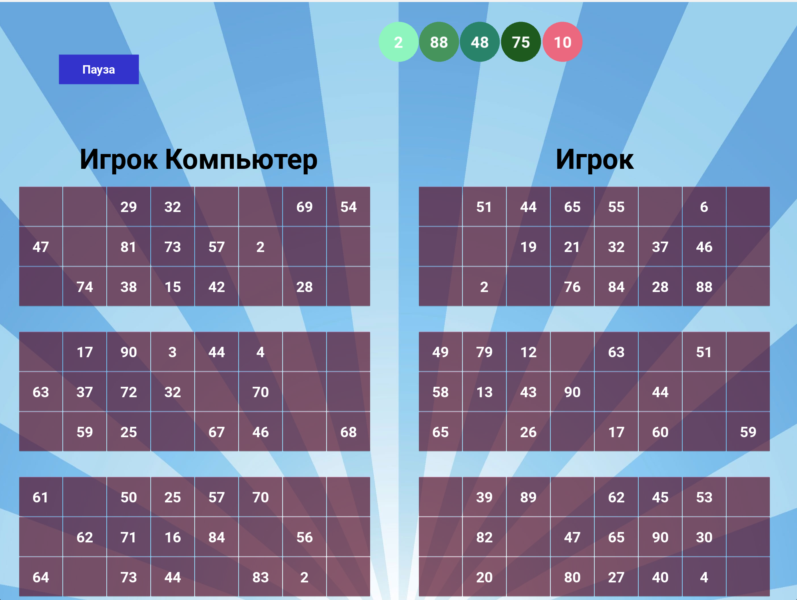

# Игра ЛОТО


Игра "Лото" - это популярная игра, в которой участники отмечают числа на специальных карточках, а затем выбираются
случайные числа из определенного диапазона. Цель игры состоит в том, чтобы первым отметить все числа на одной карточке.

В данной реализации игры нужно соревноваться с игроком "Компьютер", и быстрее закрыть числа на своих карточках.
Каждому игроку автоматически генерируется игровые карточки. Карточка содержит случайные числа от 1 до 90.

Игроку предоставляется возможность выбрать числа, нажимая на соответствующие кнопки на экране. Если число выбрано
правильно, оно исчезает, и игрок продолжает выбирать следующие числа.

В целом, код реализует основные механизмы игры "Лото" с использованием графической библиотеки Kivy для создания
интерфейса и взаимодействия с пользователем.

#### Запуск игры:

Клонируйте репозиторий Loto командой в терминале:

```commandline
...$  git clone https://github.com/AlinaProvotorova/Loto.git
```
##1 вариант: запуск файла .exe:

Находим файл `dist/LOTO.exe` и запускаем

##2 вариант: запуск main.py

```commandline
...$  python src/main.py
```
После нажатия на кнопку "Начать игру!" вы увидите сгенерированные карточки и начнут выпадать числа.



Автор: [Провоторова Алина Игоревна](https://t.me/alinamalina998)